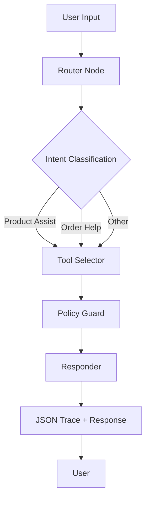

# EvoAI LangGraph Flow

This document describes the LangGraph flow implemented in the EvoAI Commerce Agent.

## Graph Structure



## Node Descriptions

### 1. Router Node
- **File:** `src/lib/agent/graph.ts`
- **Function:** `router`
- **Purpose:** Classifies user input into one of three intents:
  - `product_assist`: For product search and recommendations
  - `order_help`: For order lookup and cancellation
  - `other`: For all other queries
- **Implementation:** Uses OpenAI GPT-3.5-turbo for classification with a heuristic fallback

### 2. Tool Selector Node
- **File:** `src/lib/agent/graph.ts`
- **Function:** `toolSelector`
- **Purpose:** Executes appropriate tools based on the classified intent
- **Tools by Intent:**
  - **Product Assist:**
    - `productSearch`: Finds products matching criteria
    - `eta`: Calculates delivery estimate based on zip code
    - `sizeRecommender`: Provides size recommendations
  - **Order Help:**
    - `orderLookup`: Finds order by ID and email
    - `orderCancel`: Attempts to cancel order (enforces 60-minute policy)

### 3. Policy Guard Node
- **File:** `src/lib/agent/graph.ts`
- **Function:** `policyGuard`
- **Purpose:** Ensures policy compliance (primarily for order cancellation)
- **Implementation:** For order cancellations, checks if the 60-minute window has passed

### 4. Responder Node
- **File:** `src/lib/agent/graph.ts`
- **Function:** `responder`
- **Purpose:** Generates the final user-facing response based on tool results
- **Implementation:** Formats results into human-readable responses with appropriate messaging

## Data Flow

1. **User Input** → **Router**: Classifies intent
2. **Router** → **Tool Selector**: Executes relevant tools
3. **Tool Selector** → **Policy Guard**: Ensures compliance
4. **Policy Guard** → **Responder**: Formats final response
5. **Responder** → **User**: Returns JSON trace and user message

## State Management

The agent maintains state through the `AgentState` object defined in `src/lib/agent/graph.ts`:

```typescript
const AgentState = Annotation.Root({
  userInput: Annotation<string>,
  intent: Annotation<'product_assist' | 'order_help' | 'other'>,
  toolsCalled: Annotation<string[]>,
  evidence: Annotation<EvidenceItem[]>,
  policyDecision: Annotation<{
    cancelAllowed: boolean;
    reason?: string;
  } | undefined>,
  finalMessage: Annotation<string>,
  toolResults: Annotation<ToolResult[]>,
});
```

Each node updates the state with its results, which are then available to subsequent nodes in the flow.