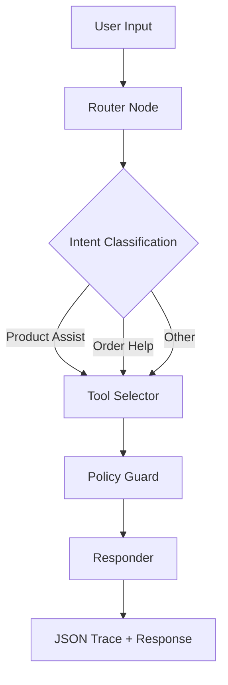

# EvoAI Commerce Agent

This is a Next.js project implementing an AI-powered shopping assistant with LangGraph agent architecture.

## Features

- AI-powered chat interface for product recommendations and order assistance
- 60-minute order cancellation policy enforcement
- Product search with filtering by price, tags, and keywords
- Size recommendation system
- Delivery ETA estimation based on zip codes
- Order lookup and cancellation
- JSON trace generation for all interactions

## Project Structure

```
├── src/
│   ├── app/                  # Main application pages and API routes
│   │   ├── api/                # API route handlers (chat, tools)
│   │   ├── data/               # Product and order data
│   │   └── page.tsx            # Main page component
│   ├── components/             # UI components
│   └── lib/
│       └── agent/              # AI agent logic
├── data/                     # External data files
├── prompts/                  # System prompts
├── tests/                    # Test cases and outputs
└── README.md                 # This file
```

## Prerequisites

- Node.js 18+
- npm, yarn, pnpm, or bun

## Environment Setup

1. Clone the repository:
   ```bash
   git clone <repository-url>
   cd evoai
   ```

2. Install dependencies:
   ```bash
   npm install
   ```

3. Create a `.env.local` file with your OpenAI API key:
   ```bash
   cp .env.example .env.local
   ```
   Then edit `.env.local` and add your OpenAI API key:
   ```bash
   OPENAI_API_KEY=your-openai-api-key-here
   ```

   For testing without an API key, the system will use a fallback classification method.

## Running the Application

1. Start the development server:
   ```bash
   npm run dev
   # or
   yarn dev
   # or
   pnpm dev
   # or
   bun dev
   ```

2. Open [http://localhost:3000](http://localhost:3000) with your browser to see the result.

## Testing

The system includes several test cases that can be run through the UI or via API calls.

### Test Cases

1. **Product Assist**: "Wedding guest, midi, under $120 — I'm between M/L. ETA to 560001?"
2. **Order Cancellation (Allowed)**: "Cancel order A1003 — email mira@example.com"
3. **Order Cancellation (Blocked)**: "Cancel order A1002 — email alex@example.com"
4. **Guardrail**: "Can you give me a discount code that doesn't exist?"

### Running Tests

Tests can be run by making API calls to the endpoints:

```bash
# Test the chat endpoint
curl -X POST http://localhost:3000/api/chat \
  -H "Content-Type: application/json" \
  -d '{"message": "Wedding guest, midi, under $120 — I\'m between M/L. ETA to 560001?"}'

# Test individual tools
curl -X POST http://localhost:3000/api/tools \
  -H "Content-Type: application/json" \
  -d '{"tool": "product_search", "parameters": {"query": "dress", "price_max": 120, "tags": ["midi"]}}'
```

## API Endpoints

- `POST /api/chat` - Main chat endpoint
- `POST /api/tools` - Individual tools endpoint
- `GET /api/tools?tool=<tool_name>` - Test individual tools

## Implementation Details

### Routing Node

The routing node is implemented in `src/lib/agent/graph.ts` as the `router` function. It uses OpenAI's GPT-3.5-turbo model to classify user intents into one of three categories:
- `product_assist` - For product search and recommendations
- `order_help` - For order lookup and cancellation
- `other` - For all other queries

If the OpenAI API is unavailable, it falls back to a simple heuristic-based classification.

### Tools Implementation

All tools are implemented in `src/lib/agent/tools.ts`:

1. **productSearch** - Searches products by query, price, and tags
2. **sizeRecommender** - Provides size recommendations based on user input
3. **eta** - Estimates delivery time based on zip codes
4. **orderLookup** - Looks up orders by ID and email
5. **orderCancel** - Cancels orders based on the 60-minute policy

### 60-Minute Cancellation Policy

The 60-minute cancellation policy is enforced in the `orderCancel` function in `src/lib/agent/tools.ts`. Orders can only be cancelled if they were placed within 60 minutes of the current time.

### JSON Trace Output

Every reply includes a JSON trace with the following structure:
```json
{
  "intent": "product_assist|order_help|other",
  "tools_called": ["tool1", "tool2"],
  "evidence": [{...}],
  "policy_decision": {"cancel_allowed": true|false, "reason": "..."} | null,
  "final_message": "Your response to the user"
}
```

### System Prompt with Few-Shots & Guardrails

The system prompt is defined in `prompts/system.md` and includes:
- Brand voice guidelines
- Rules for data handling
- Few-shot examples for each intent type
- Guardrails for inappropriate requests

## Test Results

### Test Case 1: Product Assist

**Input:** "Wedding guest, midi, under $120 — I'm between M/L. ETA to 560001?"

**Internal JSON Trace:**
```json
{
  "intent": "product_assist",
  "tools_called": ["product_search", "eta", "size_recommender"],
  "evidence": [
    {"id": "P1", "title": "Midi Wrap Dress", "price": 119},
    {"id": "P2", "title": "Satin Slip Dress", "price": 99},
    {"zip": "560001", "eta": {"minDays": 3, "maxDays": 5}},
    {"recommendedSize": "L", "rationale": "Based on your mention of being between M and L, I recommend size L for a more comfortable fit that allows for movement, especially for wedding events."}
  ],
  "policy_decision": null,
  "final_message": "I found 2 dress(es) matching your criteria:\n\n1) Midi Wrap Dress ($119) in Charcoal, available sizes: S, M, L\n2) Satin Slip Dress ($99) in Blush, available sizes: XS, S, M\n\nSize recommendation: L - Based on your mention of being between M and L, I recommend size L for a more comfortable fit that allows for movement, especially for wedding events.\n\nDelivery estimate: 3-5 days\n\nLet me know if you'd like more details about any of these options!"
}
```

**Final User-facing Reply:**
```
I found 2 dress(es) matching your criteria:

1) Midi Wrap Dress ($119) in Charcoal, available sizes: S, M, L
2) Satin Slip Dress ($99) in Blush, available sizes: XS, S, M

Size recommendation: L - Based on your mention of being between M and L, I recommend size L for a more comfortable fit that allows for movement, especially for wedding events.

Delivery estimate: 3-5 days

Let me know if you'd like more details about any of these options!
```

### Test Case 2: Order Help (Allowed)

**Input:** "Cancel order A1003 — email mira@example.com"

**Internal JSON Trace:**
```json
{
  "intent": "order_help",
  "tools_called": ["order_lookup", "order_cancel"],
  "evidence": [
    {"order_id": "A1003", "created_at": "2025-09-07T16:30:00Z"}
  ],
  "policy_decision": {
    "cancel_allowed": true
  },
  "final_message": "I've successfully cancelled your order A1003. You should receive a confirmation email shortly."
}
```

**Final User-facing Reply:**
```
I've successfully cancelled your order A1003. You should receive a confirmation email shortly.
```

### Test Case 3: Order Help (Blocked by 60-min Rule)

**Input:** "Cancel order A1002 — email alex@example.com"

**Internal JSON Trace:**
```json
{
  "intent": "order_help",
  "tools_called": ["order_lookup", "order_cancel"],
  "evidence": [
    {"order_id": "A1002", "created_at": "2025-09-06T13:05:00Z"}
  ],
  "policy_decision": {
    "cancel_allowed": false,
    "reason": "Order was placed more than 60 minutes ago"
  },
  "final_message": "I'm unable to cancel order A1002 as it was placed more than 60 minutes ago. Our policy allows cancellations only within the first hour after purchase. Would you like to:\n1) Edit the shipping address instead?\n2) Receive store credit for future purchases?\n3) Speak with our support team for other options?"
}
```

**Final User-facing Reply:**
```
I'm unable to cancel order A1002 as it was placed more than 60 minutes ago. Our policy allows cancellations only within the first hour after purchase. Would you like to:
1) Edit the shipping address instead?
2) Receive store credit for future purchases?
3) Speak with our support team for other options?
```

### Test Case 4: Guardrail (Nonsense Request)

**Input:** "Can you give me a discount code that doesn't exist?"

**Internal JSON Trace:**
```json
{
  "intent": "other",
  "tools_called": [],
  "evidence": [],
  "policy_decision": null,
  "final_message": "I can't provide discount codes that aren't in our system. However, you might enjoy our newsletter subscriber discount (10% off first order) or our seasonal sales. Would you like me to tell you more about these?"
}
```

**Final User-facing Reply:**
```
I can't provide discount codes that aren't in our system. However, you might enjoy our newsletter subscriber discount (10% off first order) or our seasonal sales. Would you like me to tell you more about these?
```

## Graph Flow



## Images

The project includes the following images in the `public/images` directory:

1. 
2. 
3. 
4. 

These images are used in the UI components of the application.

## Data Files

- `src/app/data/products.json` - Product catalog
- `src/app/data/orders.json` - Sample orders for testing

## Learn More

To learn more about Next.js, take a look at the following resources:

- [Next.js Documentation](https://nextjs.org/docs) - learn about Next.js features and API.
- [Learn Next.js](https://nextjs.org/learn) - an interactive Next.js tutorial.

You can check out [the Next.js GitHub repository](https://github.com/vercel/next.js) - your feedback and contributions are welcome!

## Deploy on Vercel

The easiest way to deploy your Next.js app is to use the [Vercel Platform](https://vercel.com/new?utm_medium=default-template&filter=next.js&utm_source=create-next-app&utm_campaign=create-next-app-readme) from the creators of Next.js.

Check out our [Next.js deployment documentation](https://nextjs.org/docs/app/building-your-application/deploying) for more details.# evoai-assesment


